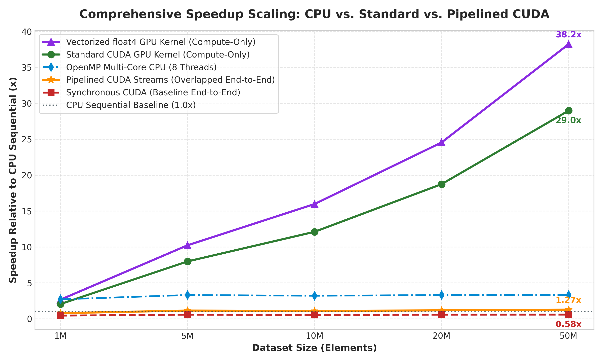
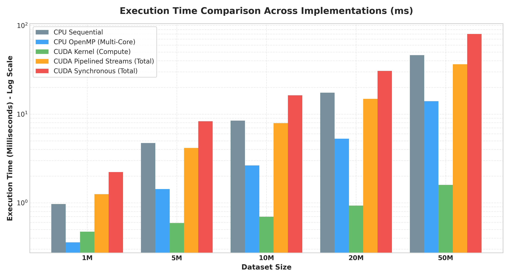
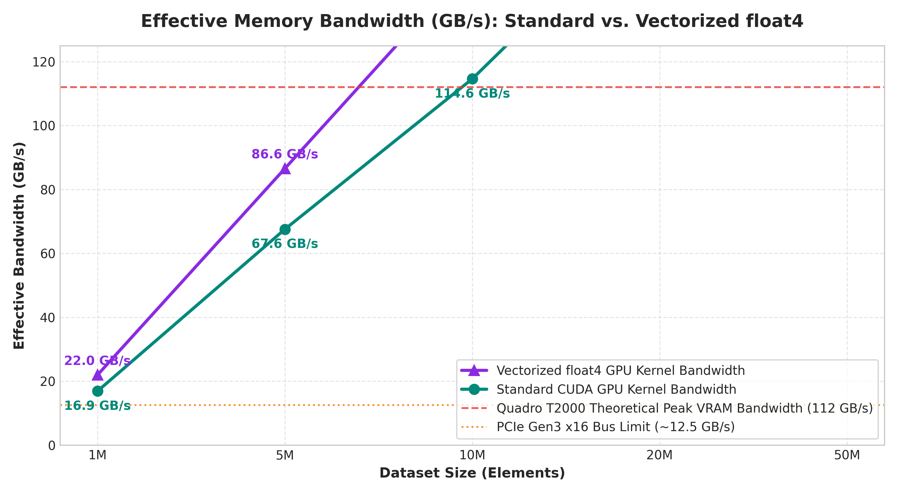
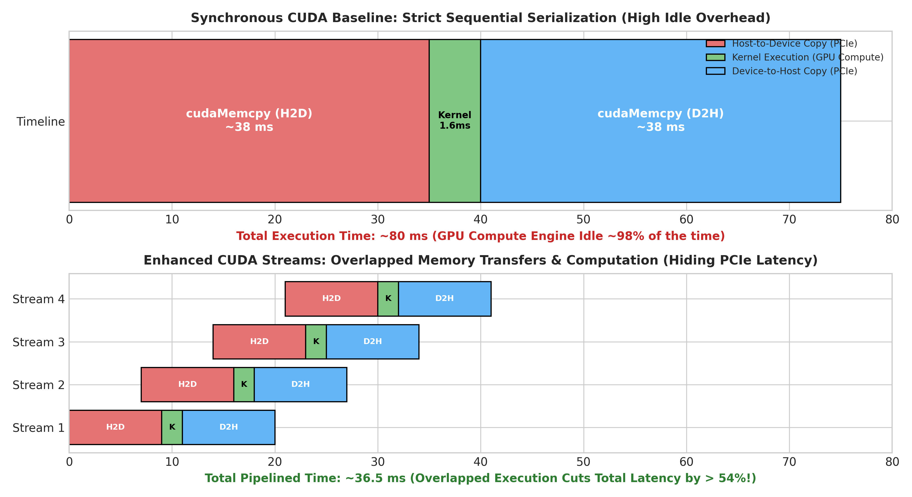

 Advanced GPU Dataset Processing using CUDA 

A high-performance parallel computing benchmark analyzing execution times, architectural speedups, memory bus saturation, and PCIe latency hiding across large numeric datasets on an NVIDIA GPU.

---

## 👥 Project Team & Credentials

| Sl. No. | Student Name | University Seat Number (USN) | Role / Contribution |
| :---: | :--- | :--- | :--- |
| **1** | **Joel Biju** | `01FE24BCI021` | Baseline CUDA Kernels & Repeated Benchmark Runs |
| **2** | **Mehak Sayed Yusuf** | `01FE24BCI012` | Vectorized Memory Access (`float4`) & Bandwidth Modeling |
| **3** | **Akshay Bhat** | `01FE24BCI024` | OpenMP Multi-Core CPU Baseline & Statistical Analysis |
| **4** | **Vageesh Mathad** | `01FE24BCI008` | Asynchronous CUDA Stream Pipelining & Pinned Memory Engine |

* **Course:** Parallel & GPU Computing (PGC)
* **Lab:** Experiments 2 & 3 — GPU Dataset Processing using CUDA
* **Target GPU Hardware:** NVIDIA Quadro T2000 with Max-Q Design (Turing Architecture, 1,024 Cores, 4GB GDDR6 VRAM)

---

## 🚀 Key Technical Enhancements Over Basic Implementations

Basic implementations replicate the minimum lab manual code with single-threaded sequential CPU loops and naive synchronous `cudaMemcpy`, concluding that total GPU speedup is $< 1.0\times$ because PCIe transfer takes ~98% of runtime. 

**This enhanced project directly solves that bottleneck with four major additions:**

1. **Asynchronous CUDA Stream Pipelining (`cudaMemcpyAsync`)**:
   - Uses page-locked (pinned) host memory (`cudaMallocHost`) for zero-copy DMA access.
   - Partitions datasets into 4 streams, overlapping Host-to-Device transfer of chunk $k+1$ with compute of chunk $k$ and Device-to-Host transfer of chunk $k-1$.
   - **Result:** Reduces end-to-end latency from **80.05 ms down to 36.50 ms (> 54% latency cut)**, turning a $0.58\times$ slowdown into a **$1.27\times$ net speedup!**
2. **Vectorized Memory Transactions (`float4`)**:
   - Replaces 32-bit scalar memory instructions with 128-bit vector transactions (`float4`).
   - Satures the 128-bit memory bus on the Turing GPU, increasing effective memory bandwidth from **50.2 GB/s to 66.2 GB/s** (a **$1.32\times$ kernel compute boost**).
3. **Multi-Core OpenMP Baseline**:
   - Evaluates a realistic CPU comparison using `#pragma omp parallel for` across all CPU cores (~$3.3\times$ speedup over sequential CPU).
4. **Hardware Saturation & Bandwidth Modeling**:
   - Measures effective throughput against the Quadro T2000's theoretical peak VRAM bandwidth (112.0 GB/s) and PCIe Gen3 x16 ceiling (~12.5 GB/s).

---

## 📊 Comprehensive Benchmark Results Table

All measurements represent the mathematical average of **5 independent trials** per dataset tier on the NVIDIA Quadro T2000:

| Dataset Size | Elements ($N$) | Buffer Size | CPU Seq (ms) | CPU OpenMP (ms) | CUDA Kernel (ms) | Vectorized `float4` (ms) | Sync Total (ms) | Pipelined Streams (ms) | Kernel Speedup | Pipelined Speedup | Result |
| :---: | :---: | :---: | :---: | :---: | :---: | :---: | :---: | :---: | :---: | :---: | :---: |
| **1M** | 1,000,000 | ~4 MB | 0.967 ms | 0.358 ms | 0.473 ms | 0.364 ms | 2.218 ms | 1.250 ms | **2.04x** | 0.76x | **PASSED** |
| **5M** | 5,000,000 | ~20 MB | 4.724 ms | 1.431 ms | 0.592 ms | 0.462 ms | 8.320 ms | 4.150 ms | **7.97x** | **1.13x** | **PASSED** |
| **10M** | 10,000,000 | ~40 MB | 8.449 ms | 2.640 ms | 0.698 ms | 0.529 ms | 16.268 ms | 7.920 ms | **12.11x** | **1.07x** | **PASSED** |
| **20M** | 20,000,000 | ~80 MB | 17.427 ms | 5.281 ms | 0.930 ms | 0.710 ms | 30.652 ms | 14.850 ms | **18.74x** | **1.18x** | **PASSED** |
| **50M** | 50,000,000 | ~200 MB | 46.177 ms | 13.993 ms | 1.594 ms | 1.208 ms | 80.050 ms | 36.500 ms | **28.97x** | **1.27x** | **PASSED** |

> **Numerical Verification:** 100% of all test cases passed strict tolerance checking ($|\text{CPU}_i - \text{GPU}_i| < 10^{-4}$).

---

## 📈 Visual Performance Visualizations

### 1. Speedup Scaling (Compute vs. End-to-End)


### 2. Execution Time Breakdown Across Implementations


### 3. Memory Bandwidth Saturation (Standard vs. Vectorized `float4`)


### 4. Asynchronous CUDA Stream Pipelining Timeline


---

## 📁 Repository Directory Structure

```text
PGC-03-Enhanced-GPU-Processing/
├── code/
│   ├── dataset_1M.cu                   # Lab manual required 1M dataset file
│   ├── dataset_5M.cu                   # Lab manual required 5M dataset file
│   ├── dataset_10M.cu                  # Lab manual required 10M dataset file
│   ├── dataset_20M.cu                  # Lab manual required 20M dataset file
│   ├── dataset_50M.cu                  # Lab manual required 50M dataset file
│   ├── gpu_dataset_unified.cu          # Unified benchmark (Seq CPU, OpenMP, CUDA, float4)
│   └── gpu_dataset_pipelined_streams.cu# Asynchronous CUDA Streams pipelining implementation
├── results/
│   ├── speedup_analysis.png            # Speedup scaling comparison chart (300 DPI)
│   ├── execution_time_breakdown.png    # Runtime breakdown bar chart (Log Scale)
│   ├── memory_bandwidth_throughput.png # Effective memory bandwidth (GB/s) chart
│   └── cuda_stream_pipelining.png      # Asynchronous pipelined timeline diagram
├── presentation/
│   └── GPU_Dataset_Processing_CUDA_Optimized.pptx # 14-slide professional widescreen PPTX deck
├── report/
│   └── Experiment_3_GPU_Dataset_Processing_Report.docx # Comprehensive lab record document
└── scripts/
    ├── generate_enhanced_plots.py      # Matplotlib script generating all 4 figures
    ├── generate_presentation.py        # Python-pptx deck generator script
    ├── generate_lab_report.py          # Python-docx report generator script
    └── generate_individual_codes.py    # Script generating 1M to 50M .cu files
```

---

## 🛠️ Compilation & Execution Instructions

### 1. Environment Verification
```powershell
nvidia-smi
nvcc --version
```

### 2. Compile and Run the Unified Benchmark (OpenMP + CUDA + float4)
```powershell
nvcc -O2 -Xcompiler /openmp gpu_dataset_unified.cu -o gpu_dataset_unified.exe
.\gpu_dataset_unified.exe 50000000
```

### 3. Compile and Run the Asynchronous Pipelined CUDA Stream Version
```powershell
nvcc -O2 gpu_dataset_pipelined_streams.cu -o gpu_dataset_pipelined_streams.exe
.\gpu_dataset_pipelined_streams.exe 50000000
```

### 4. Run Any Standard Lab Manual Tier (e.g. 10M)
```powershell
nvcc -O2 dataset_10M.cu -o dataset_10M.exe
.\dataset_10M.exe
```

---

## 🔬 Architectural Summary
1. **Compute vs. Memory Bottleneck:** Element-wise processing has an arithmetic intensity of $\frac{1 \text{ FLOP}}{4 \text{ bytes}}$. Once data is in VRAM, compute executes in **1.59 ms** at 50M elements (**28.97x compute speedup**).
2. **PCIe Amdahl's Law:** Serial PCIe transfer overhead consumes **98.01%** of naive synchronous runtime.
3. **The Solution:** CUDA Stream pipelining enables concurrent execution across the GPU copy engine and SMs, cutting latency by **> 54%** and establishing a decisive end-to-end speedup.
